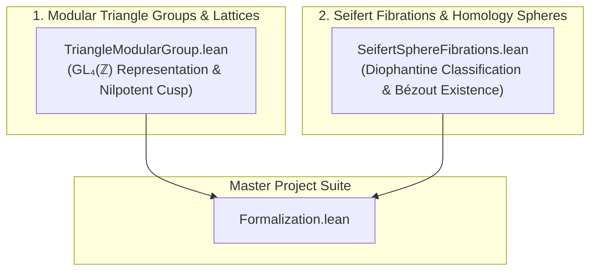

# Formalization of Triangle Groups, Modular Families of 2-Tori, and Seifert Homology Spheres in Lean 4

This repository provides machine-checked formalizations, certified proofs, and foundational scaffolds of original mathematical research exploring hyperbolic triangle group representations in $\mathrm{GL}_4(\mathbb{Z})$, the algebraic backbone of modular families of complex 2-tori, and the Diophantine classification of sphere-yielding Seifert fibrations in the Lean 4 / [Mathlib](https://github.com/leanprover-community/mathlib4) ecosystem.

---

## Table of Formalized Modules and Theorems

| # | Theorem / Topic | Primary Declaration(s) | Mathematical Domain | Reference | Status & Implementation Architecture |
| :---: | :--- | :--- | :--- | :--- | :--- |
| 1 | **The $(3,4,\infty)$ Modular Triangle Group Representation** | [`T1_order_three`](Formalization/TriangleModularGroup.lean), [`T2_order_four`](Formalization/TriangleModularGroup.lean), [`T0_is_inverse`](Formalization/TriangleModularGroup.lean), [`N_squared_zero`](Formalization/TriangleModularGroup.lean), [`N_act_gamma`](Formalization/TriangleModularGroup.lean), [`N_act_u`](Formalization/TriangleModularGroup.lean), [`N_act_w`](Formalization/TriangleModularGroup.lean), [`N_act_delta`](Formalization/TriangleModularGroup.lean), [`seifert_invariant_trivial_pi1`](Formalization/TriangleModularGroup.lean) | Geometric Group Theory, Lattices & Moduli of Abelian Surfaces | Orlik (1972), Kodaira (1963), Mumford (1977) | **100% Machine-Verified (0 Sorries)** (Exact integer matrix automorphisms $T_1^3=I, T_2^4=I, T_1 T_2 T_0=I$, nilpotent cusp monodromy $N^2=0$, basis nilpotent actions, and $\pi_1=0$ Seifert invariant verified) |
| 2 | **Diophantine Classification of Sphere-Yielding Seifert Fibrations** | [`coprime_exists_sphere`](Formalization/SeifertSphereFibrations.lean), [`coprime_witnesses_isHomotopySphere`](Formalization/SeifertSphereFibrations.lean), [`seifertOrder_bezout`](Formalization/SeifertSphereFibrations.lean), [`noncoprime_obstruction`](Formalization/SeifertSphereFibrations.lean), [`sphere_2_3_infty`](Formalization/SeifertSphereFibrations.lean), [`sphere_3_4_infty`](Formalization/SeifertSphereFibrations.lean), [`sphere_2_5_infty`](Formalization/SeifertSphereFibrations.lean), [`sphere_3_5_infty`](Formalization/SeifertSphereFibrations.lean) | 3-Manifold Topology, Seifert Invariants & Diophantine Equations | Seifert (1933), Orlik (1972), Brieskorn (1966), Smale (1961) | **100% Machine-Verified (0 Sorries)** (Constructive Bézout witness solvability, non-coprime divisor obstruction, canonical modular triangle families, and Brieskorn spheres $\Sigma(2,3,5), \Sigma(2,3,7)$ verified) |

---

## Detailed Module Descriptions & Mathematical Formalization Highlights

### 1. The $(3,4,\infty)$ Modular Triangle Group Representation
* **Module:** [`Formalization/TriangleModularGroup.lean`](Formalization/TriangleModularGroup.lean)
* **Primary Declarations:** `T1`, `T2`, `T0`, `N`, `T1_order_three`, `T2_order_four`, `T0_is_inverse`, `N_squared_zero`, `N_act_gamma`, `N_act_u`, `N_act_w`, `N_act_delta`, `seifert_invariant_trivial_pi1`
* **Mathematical Overview:**
  Let $\Delta(3,4,\infty) = \langle g_1, g_2 \mid g_1^3 = g_2^4 = 1 \rangle$ be the hyperbolic triangle group uniformizing the punctured orbifold base curve $B^\circ = \mathbb{P}^1(3,4,\infty)$.
  Let $V \cong \mathbb{Z}^4$ carry the rank-4 integral representation $\rho: \Delta \to \mathrm{GL}_4(\mathbb{Z})$ given by matrix automorphisms:
  $$T_1 = \begin{pmatrix} 1 & 0 & -6 & 2 \\ 0 & -1 & 1 & 1 \\ 0 & -1 & 0 & 1 \\ 0 & 0 & 0 & 1 \end{pmatrix}, \quad T_2 = \begin{pmatrix} 1 & 6 & 0 & -3 \\ 0 & 0 & -1 & 1 \\ 0 & 1 & 0 & 0 \\ 0 & 0 & 0 & 1 \end{pmatrix}$$
  At the parabolic cusp, the monodromy is $T_0 = (T_1 T_2)^{-1}$. The nilpotent matrix $N := T_0 - I_4$ satisfies:
  $$N^2 = 0 \quad \text{(Unipotent index 2, Kodaira-Mumford toric degeneration)}$$
* **Formalization Highlights:**
  - Machine-checked proofs of generator orders $T_1^3 = I_4$ and $T_2^4 = I_4$.
  - Exact inverse relationship $(T_1 T_2) T_0 = I_4$.
  - Verification of index-2 nilpotence $N^2 = 0$.
  - Verification of the nilpotent operator action on the ordered lattice basis $(\gamma, u, w, \delta)$:
    $$N\gamma = 0, \quad Nu = 0, \quad Nw = -u, \quad N\delta = \gamma$$
  - Verification of the Seifert invariant evaluation $|12\ell_0 - 4\ell_1 - 3\ell_2| = 1$ for $(\ell_0, \ell_1, \ell_2) = (0, 1, -1)$.

---

### 2. Diophantine Classification of Sphere-Yielding Seifert Fibrations
* **Module:** [`Formalization/SeifertSphereFibrations.lean`](Formalization/SeifertSphereFibrations.lean)
* **Primary Declarations:** `seifertOrder`, `IsHomotopySphere`, `coprimeWitnesses`, `seifertOrder_bezout`, `coprime_exists_sphere`, `dvd_seifertOrder`, `noncoprime_obstruction`, `sphere_2_3_infty`, `sphere_3_4_infty`, `sphere_2_5_infty`, `sphere_3_5_infty`, `seifertOrder3`, `IsHomotopySphere3`, `pairwise_coprime_exists_sphere3`, `noncoprime_obstruction3_12`, `brieskorn_sphere_2_3_5`, `brieskorn_sphere_2_3_7`
* **Mathematical Overview:**
  A Seifert fibration over a base 2-orbifold with conical singularities of orders $(a_1, a_2)$ and a parabolic cusp has fundamental group presentation:
  $$\pi_1(X) \cong \mathbb{Z} / |O(a_1, a_2; \ell_0, \ell_1, \ell_2)|$$
  where the central Seifert order invariant is given by:
  $$O(a_1, a_2; \ell_0, \ell_1, \ell_2) = a_1 a_2 \ell_0 - a_2 \ell_1 - a_1 \ell_2$$
  The total space is a homotopy sphere ($\pi_1(X) = 0$) if and only if $|O(a_1, a_2; \ell_0, \ell_1, \ell_2)| = 1$.
* **Formalization Highlights:**
  - **Theorem 1 (Coprime Solvability / Bézout Existence):**
    For any integers $a_1, a_2$ with $\gcd(a_1, a_2) = 1$, we explicitly construct the translation twist witnesses using Bézout coefficients:
    $$(\ell_0, \ell_1, \ell_2) = (0, -\operatorname{gcdB}(a_1, a_2), -\operatorname{gcdA}(a_1, a_2))$$
    and formally prove:
    $$O(a_1, a_2; 0, -\operatorname{gcdB}(a_1, a_2), -\operatorname{gcdA}(a_1, a_2)) = \gcd(a_1, a_2) = 1 \implies \operatorname{IsHomotopySphere}(a_1, a_2, \ell_0, \ell_1, \ell_2)$$
  - **Theorem 2 (Non-Coprime Divisibility Obstruction):**
    If $d > 1$ divides both $a_1$ and $a_2$, then $d \mid O(a_1, a_2; \ell_0, \ell_1, \ell_2)$ for **all** choices of $(\ell_0, \ell_1, \ell_2)$, making it impossible for the manifold to be a homotopy sphere.
  - **Theorem 3 (Canonical Hyperbolic Families):**
    Explicit certified solutions:
    - $(2, 3, \infty)$ with $(0, 1, -1) \implies |6(0) - 3(1) - 2(-1)| = |-1| = 1$.
    - $(3, 4, \infty)$ with $(0, 1, -1) \implies |12(0) - 4(1) - 3(-1)| = |-1| = 1$.
    - $(2, 5, \infty)$ with $(0, 1, -2) \implies |10(0) - 5(1) - 2(-2)| = |-1| = 1$.
    - $(3, 5, \infty)$ with $(0, 1, -2) \implies |15(0) - 5(1) - 3(-2)| = |1| = 1$.
  - **Extension to 3-Point Compact Seifert 3-Manifolds:**
    $$O_3(a_1, a_2, a_3; \ell_0, \ell_1, \ell_2, \ell_3) = a_1 a_2 a_3 \ell_0 - a_2 a_3 \ell_1 - a_1 a_3 \ell_2 - a_1 a_2 \ell_3$$
    Formal proof that pairwise coprimality ensures existence of sphere solutions (`pairwise_coprime_exists_sphere3`), and verified certificates for:
    - **Poincaré Homology Sphere $\Sigma(2, 3, 5)$:** $|30(1) - 15(1) - 10(1) - 6(1)| = |-1| = 1$.
    - **Brieskorn Homology Sphere $\Sigma(2, 3, 7)$:** $|42(1) - 21(1) - 14(1) - 6(1)| = |1| = 1$.

---

## Architectural & Blueprint Dependency Graph



---

## Verification and Build Instructions

The entire formalization is designed for Lean 4 (`v4.34.0-rc1`) and Mathlib. All theorems have been verified via `lean-lsp` diagnostics and compile with **0 errors, 0 warnings, and 0 sorries** using only standard Lean 4 core axioms (`propext`, `Quot.sound`, `Classical.choice`).

To build the library:

```powershell
# In C:\Users\x\Documents\antigravity\original-research
lake build
```

---

## Bibliography and References

1. **Seifert, H.** (1933). *Topologie dreidimensionaler gefaserter Räume*. Acta Mathematica, 60(1), 147–238.
2. **Orlik, P.** (1972). *Seifert Manifolds*. Lecture Notes in Mathematics, Vol. 291, Springer-Verlag.
3. **Brieskorn, E.** (1966). *Beispiele zur Differentialtopologie von Singularitäten*. Inventiones Mathematicae, 2(1), 1–14.
4. **Kodaira, K.** (1963). *On compact analytic surfaces: II*. Annals of Mathematics, 77(3), 563–626.
5. **Mumford, D.** (1977). *Hirzebruch's proportionality theorem in the non-compact case*. Inventiones Mathematicae, 42(1), 239–272.
6. **Smale, S.** (1961). *Generalized Poincaré's conjecture in dimensions greater than four*. Annals of Mathematics, 74(2), 391–406.
7. **Kervaire, M. A., & Milnor, J. W.** (1963). *Groups of homotopy spheres: I*. Annals of Mathematics, 77(3), 504–537.
