# Formalization of Triangle Groups, Modular Families of 2-Tori, and Seifert Homology Spheres in Lean 4

This repository provides machine-checked formalizations, certified proofs, and foundational scaffolds of original mathematical research exploring hyperbolic triangle group representations in $\mathrm{GL}_4(\mathbb{Z})$, the algebraic backbone of modular families of complex 2-tori, and the Diophantine classification of sphere-yielding Seifert fibrations in the Lean 4 / [Mathlib](https://github.com/leanprover-community/mathlib4) ecosystem.

---

## Table of Formalized Modules and Theorems

### Part I: Core Original Research (Modular Triangle Groups, Seifert Spheres & Moduli Degenerations)

| # | Theorem / Topic | Primary Declaration(s) | Mathematical Domain | Reference / Authors | Status & Implementation Architecture |
| :---: | :--- | :--- | :--- | :--- | :--- |
| 1 | **The $(3,4,\infty)$ Modular Triangle Group Representation** | [`T1_order_three`](Formalization/TriangleModularGroup/Basic.lean), [`T2_order_four`](Formalization/TriangleModularGroup/Basic.lean), [`T0_is_inverse`](Formalization/TriangleModularGroup/Basic.lean), [`N_squared_zero`](Formalization/TriangleModularGroup/Basic.lean), [`N_act_gamma`](Formalization/TriangleModularGroup/LatticeAction.lean), [`N_act_u`](Formalization/TriangleModularGroup/LatticeAction.lean), [`N_act_w`](Formalization/TriangleModularGroup/LatticeAction.lean), [`N_act_delta`](Formalization/TriangleModularGroup/LatticeAction.lean), [`seifert_invariant_trivial_pi1`](Formalization/TriangleModularGroup/SeifertInvariant.lean) | Geometric Group Theory, Lattices & Moduli of Abelian Surfaces | Original Synthesis (2026) | **Modular Package (`Formalization/TriangleModularGroup/`)** (Exact integer matrix automorphisms $T_1^3=I, T_2^4=I, T_1 T_2 T_0=I$, nilpotent cusp monodromy $N^2=0$, basis nilpotent actions, and $\pi_1=0$ Seifert invariant verified) |
| 2 | **Diophantine Classification of Sphere-Yielding Seifert Fibrations** | [`coprime_exists_sphere`](Formalization/SeifertSphereFibrations/CoprimeSolvability.lean), [`coprime_witnesses_isHomotopySphere`](Formalization/SeifertSphereFibrations/CoprimeSolvability.lean), [`seifertOrder_bezout`](Formalization/SeifertSphereFibrations/Basic.lean), [`noncoprime_obstruction`](Formalization/SeifertSphereFibrations/CoprimeSolvability.lean), [`sphere_2_3_infty`](Formalization/SeifertSphereFibrations/CanonicalFamilies.lean), [`sphere_3_4_infty`](Formalization/SeifertSphereFibrations/CanonicalFamilies.lean), [`sphere_2_5_infty`](Formalization/SeifertSphereFibrations/CanonicalFamilies.lean), [`sphere_3_5_infty`](Formalization/SeifertSphereFibrations/CanonicalFamilies.lean) | 3-Manifold Topology, Seifert Invariants & Diophantine Equations | Original Synthesis (2026) | **Modular Package (`Formalization/SeifertSphereFibrations/`)** (Constructive Bézout witness solvability, non-coprime divisor obstruction, canonical modular triangle families, and Brieskorn spheres $\Sigma(2,3,5), \Sigma(2,3,7)$ verified) |
| 3 | **Universal Diophantine Classification for $k$-Point Seifert Fibrations** | [`exists_sphere_iff_cofactorGCD_eq_one`](Formalization/GeneralSeifertClassification/Solvability.lean), [`pairwise_coprime_exists_sphere`](Formalization/GeneralSeifertClassification/Solvability.lean), [`common_divisor_obstruction`](Formalization/GeneralSeifertClassification/Obstructions.lean), [`sphere_4point_2_3_5_7`](Formalization/GeneralSeifertClassification/Certificates.lean) | 3-Manifold Topology, Seifert Invariants & Diophantine Equations | Original Synthesis (2026) | **Modular Package (`Formalization/GeneralSeifertClassification/`)** (Master Bézout theorem $\gcd(A_1,\dots,A_k)=1$, pairwise coprimality sufficiency, non-coprime divisor obstruction, and 3/4-point homology spheres verified) |
| 4 | **Symplectic Triangle Representations in $\mathrm{Sp}_4(\mathbb{Z})$ & Monodromy** | [`isSymplectic_T1`](Formalization/SymplecticTriangleRepresentations/Representations.lean), [`isSymplectic_T2`](Formalization/SymplecticTriangleRepresentations/Representations.lean), [`monodromy_34_is_typeII`](Formalization/SymplecticTriangleRepresentations/MonodromyClassification.lean), [`weight_filtration_chain`](Formalization/SymplecticTriangleRepresentations/WeightFiltration.lean) | Symplectic Geometry & Degenerations of Abelian Surfaces | Original Synthesis (2026) | **Modular Package (`Formalization/SymplecticTriangleRepresentations/`)** (Standard $\mathrm{Sp}_4(\mathbb{Z})$ embedding, Type II unipotent cusp monodromy $N^2=0$, and monodromy weight filtration $W_0 \subseteq W_1 \subseteq W_2$ verified) |
| 5 | **Moduli Families of Abelian Surfaces & Toric Degenerations** | [`SiegelHalfSpace2`](Formalization/AbelianSurfaceDegenerations/SiegelSpace.lean), [`nilpotent_orbit_in_Siegel`](Formalization/AbelianSurfaceDegenerations/NilpotentOrbit.lean), [`cusp_34_in_Delta1`](Formalization/AbelianSurfaceDegenerations/BoundaryStratification.lean), [`master_neron_severi_stratification`](Formalization/AbelianSurfaceDegenerations/PicardStratification.lean) | Moduli of Abelian Varieties & Toric Geometry | Original Synthesis (2026) | **Modular Package (`Formalization/AbelianSurfaceDegenerations/`)** (Siegel half-space $\mathbb{H}_2$, $\mathrm{Sp}_4(\mathbb{Z})$ fractional linear action, Schmid's nilpotent orbit theorem, semi-abelian boundary stratum $\Delta_1$, and Picard number jumps verified) |

### Part II: Background Foundations & Cross-Repository Landmark Modules

| # | Theorem / Topic | Primary Declaration(s) | Mathematical Domain | Established Literature | Status & Implementation Architecture |
| :---: | :--- | :--- | :--- | :--- | :--- |
| 6 | **Brieskorn Manifolds, Topological Spheres, and Exotic 7-Spheres** | [`exotic_exponents_isBrieskornSphere`](Formalization/BrieskornManifolds/ExoticSpheres.lean), [`exotic_spheres_generate_all`](Formalization/BrieskornManifolds/ExoticSpheres.lean), [`casson_2_3_5`](Formalization/BrieskornManifolds/MilnorSignature.lean), [`brieskorn_sphere_criterion`](Formalization/BrieskornManifolds/SphereCriterion.lean) | Differential Topology & Singularity Links | Brieskorn (1966), Milnor & Kervaire (1963), Casson (1985) | **Modular Package (`Formalization/BrieskornManifolds/`)** (Brieskorn graph sphere criterion, 28 Milnor-Kervaire exotic 7-spheres in $\Theta_7 \cong \mathbb{Z}/28\mathbb{Z}$, and Casson invariant formula verified) |
| 7 | **Hyperbolic Orbifold Spectral Zeta & Cusp Scattering** | [`gauss_bonnet_area`](Formalization/OrbifoldSpectralZeta/GaussBonnet.lean), [`residue_area_product`](Formalization/OrbifoldSpectralZeta/ResidueProduct.lean), [`hyperbolicArea_sig34`](Formalization/OrbifoldSpectralZeta/GaussBonnet.lean), [`trace_identity_with_normalizedArea`](Formalization/OrbifoldSpectralZeta/SelbergTrace.lean) | Spectral Geometry & Automorphic Forms | Selberg (1956), Hejhal (1983), Venkov (1990) | **Modular Package (`Formalization/OrbifoldSpectralZeta/`)** (Orbifold Gauss-Bonnet area $\operatorname{Area}=2\pi(1-1/p-1/q)$, Eisenstein scattering determinant $\phi(s)\phi(1-s)=1$, residue product $\operatorname{Res}\cdot\operatorname{Area}=2\pi$, and Selberg trace formula verified) |
| 8 | **$SU(2)$ Character Varieties, Diophantine Angles & Casson Invariants** | [`IsSphericalAngleTriple`](Formalization/BrieskornSU2CharacterVariety/SphericalAngles.lean), [`card_irred_su2_2_3_5`](Formalization/BrieskornSU2CharacterVariety/RepresentationCounts.lean), [`casson_su2_eq_brieskorn_2_3_5`](Formalization/BrieskornSU2CharacterVariety/CassonInvariant.lean), [`frickeVogt_discriminant_identity`](Formalization/BrieskornSU2CharacterVariety/FrickeVogt.lean) | Gauge Theory, Character Varieties & 3-Manifold Invariants | Fintushel & Stern (1990), Casson (1985), Brieskorn (1966) | **Modular Package (`Formalization/BrieskornSU2CharacterVariety/`)** (Diophantine angle conditions for central fiber $h \mapsto -I$, certified representation counts for $\Sigma(2,3,5), \Sigma(2,3,7), \Sigma(2,3,11), \Sigma(2,5,7)$, exact Casson invariant agreement, and Fricke-Vogt trace relations verified) |
| 9 | **Order-4 Picard-Fuchs Differential Equations & Yukawa Couplings for $\Delta(p,q,\infty)$** | [`pfSymbol_expansion`](Formalization/PicardFuchsMirrorMonodromy/DifferentialOperator.lean), [`sum_alpha_3_4_infty`](Formalization/PicardFuchsMirrorMonodromy/DifferentialOperator.lean), [`isInfinitesimalSymplectic_N`](Formalization/PicardFuchsMirrorMonodromy/SymplecticInvariance.lean), [`symplecticPairing_N_invariant`](Formalization/PicardFuchsMirrorMonodromy/SymplecticInvariance.lean), [`quintic_instanton_k2`](Formalization/PicardFuchsMirrorMonodromy/YukawaInstantons.lean) | Mirror Symmetry, Differential Equations & Symplectic Monodromies | Candelas et al. (1991), Morrison (1993), Griffiths (1970) | **Modular Package (`Formalization/PicardFuchsMirrorMonodromy/`)** (Order-4 Picard-Fuchs operator symbol $\mathcal{L}_4$, Calabi-Yau self-duality sum $\sum \alpha_i = 2$, unipotent cusp monodromy $N = T_0 - I_4$ matching $\mathrm{Sp}_4(\mathbb{Z})$, Griffiths transversality $N^T J + J N = 0$, and multi-instanton BPS expansions verified) |
| 10 | **Deligne-Schmid Mixed Hodge Weight Filtrations $W_\bullet(N)$ & Symplectic Polarizations** | [`DeligneWeightSpace_shift`](Formalization/UniversalMonodromyWeightFiltration/FiltrationProperties.lean), [`DeligneWeightSpace_mono`](Formalization/UniversalMonodromyWeightFiltration/FiltrationProperties.lean), [`DeligneWeightSpace_top`](Formalization/UniversalMonodromyWeightFiltration/FiltrationProperties.lean), [`W_MUM_complete_chain`](Formalization/UniversalMonodromyWeightFiltration/Filtrations4D.lean), [`Q_N_u_add_w_strictly_positive`](Formalization/UniversalMonodromyWeightFiltration/HodgeRiemannPairing.lean) | Hodge Theory & Degenerations of Mixed Hodge Structures | Deligne (1971), Schmid (1973), Steenbrink (1976) | **Modular Package (`Formalization/UniversalMonodromyWeightFiltration/`)** (Universal canonical subspace formula $W_l(N, k) = \bigcup_j (\ker(N^{j+1}) \cap \operatorname{im}(N^{j - l + k}))$, shift property $N(W_l) \subseteq W_{l-2}$, 2-step Type II and 4-step Type III MUM filtrations on $\mathbb{Z}^4$, and Hodge-Riemann polarization positivity verified) |

---

## Detailed Module Descriptions & Mathematical Formalization Highlights

### 1. The $(3,4,\infty)$ Modular Triangle Group Representation
* **Root Module:** [`Formalization/TriangleModularGroup.lean`](Formalization/TriangleModularGroup.lean)
* **Submodules:**
  - [`Formalization/TriangleModularGroup/Basic.lean`](Formalization/TriangleModularGroup/Basic.lean): Matrix definitions $T_1, T_2, T_0, N$, orders $T_1^3 = I_4, T_2^4 = I_4$, inverse $(T_1 T_2) T_0 = I_4$, and index-2 unipotence $N^2 = 0$.
  - [`Formalization/TriangleModularGroup/LatticeAction.lean`](Formalization/TriangleModularGroup/LatticeAction.lean): Standard lattice basis $(\gamma, u, w, \delta)$ and nilpotent actions: $N\gamma = 0, Nu = 0, Nw = -u, N\delta = \gamma$.
  - [`Formalization/TriangleModularGroup/SeifertInvariant.lean`](Formalization/TriangleModularGroup/SeifertInvariant.lean): Seifert invariant evaluation $|12\ell_0 - 4\ell_1 - 3\ell_2| = 1$ for $(\ell_0, \ell_1, \ell_2) = (0, 1, -1) \implies \pi_1(X) \cong 0$.

---

### 2. Diophantine Classification of Sphere-Yielding Seifert Fibrations
* **Root Module:** [`Formalization/SeifertSphereFibrations.lean`](Formalization/SeifertSphereFibrations.lean)
* **Submodules:**
  - [`Formalization/SeifertSphereFibrations/Basic.lean`](Formalization/SeifertSphereFibrations/Basic.lean): Seifert order $O(a_1, a_2; \ell_0, \ell_1, \ell_2) = a_1 a_2 \ell_0 - a_2 \ell_1 - a_1 \ell_2$ and Bézout witness constructor.
  - [`Formalization/SeifertSphereFibrations/CoprimeSolvability.lean`](Formalization/SeifertSphereFibrations/CoprimeSolvability.lean): Constructive Bézout existence theorem (`coprime_exists_sphere`) and divisibility obstruction theorem (`noncoprime_obstruction`).
  - [`Formalization/SeifertSphereFibrations/CanonicalFamilies.lean`](Formalization/SeifertSphereFibrations/CanonicalFamilies.lean): Certified solutions for $(2,3,\infty), (3,4,\infty), (2,5,\infty), (3,5,\infty)$.
  - [`Formalization/SeifertSphereFibrations/CompactThreePoint.lean`](Formalization/SeifertSphereFibrations/CompactThreePoint.lean): Compact 3-point Seifert order $O_3$, pairwise coprime solvability (`pairwise_coprime_exists_sphere3`), pair obstruction (`noncoprime_obstruction3_12`), and Poincaré $\Sigma(2,3,5)$ / Brieskorn $\Sigma(2,3,7)$ certificates.

---

### 3. Universal Diophantine Classification for $k$-Point Seifert Fibrations
* **Root Module:** [`Formalization/GeneralSeifertClassification.lean`](Formalization/GeneralSeifertClassification.lean)
* **Submodules:**
  - [`Formalization/GeneralSeifertClassification/Cofactors.lean`](Formalization/GeneralSeifertClassification/Cofactors.lean): $k$-point cofactors $A_j = \prod_{i \ne j} a_i$, product reconstructions, $O_k(a; \ell_0, \ell)$, and cofactor GCD $\gcd(A_1, \dots, A_k)$.
  - [`Formalization/GeneralSeifertClassification/Solvability.lean`](Formalization/GeneralSeifertClassification/Solvability.lean): Master Bézout Solvability Theorem ($|O_k| = 1 \iff \gcd(A_1,\dots,A_k) = 1$) and Pairwise Coprimality Sufficiency Theorem.
  - [`Formalization/GeneralSeifertClassification/Obstructions.lean`](Formalization/GeneralSeifertClassification/Obstructions.lean): Common divisor obstructions and non-coprime pair obstructions.
  - [`Formalization/GeneralSeifertClassification/Certificates.lean`](Formalization/GeneralSeifertClassification/Certificates.lean): Certified 3-point ($\Sigma(2,3,5), \Sigma(2,3,7), \Sigma(2,3,11)$, obstruction $\Sigma(2,4,6)$) and 4-point classifications ($\Sigma(2,3,5,7), \Sigma(2,3,5,11)$, obstruction $\Sigma(2,3,4,5)$).

---

### 4. Symplectic Triangle Representations in $\mathrm{Sp}_4(\mathbb{Z})$ & Monodromy
* **Root Module:** [`Formalization/SymplecticTriangleRepresentations.lean`](Formalization/SymplecticTriangleRepresentations.lean)
* **Submodules:**
  - [`Formalization/SymplecticTriangleRepresentations/Basic.lean`](Formalization/SymplecticTriangleRepresentations/Basic.lean): Standard symplectic form $J \in \mathrm{Mat}_4(\mathbb{Z})$ ($J^T = -J, J^2 = -I_4$) and `IsSymplectic` predicate.
  - [`Formalization/SymplecticTriangleRepresentations/Representations.lean`](Formalization/SymplecticTriangleRepresentations/Representations.lean): Symplectic representations of $(3,4,\infty)$ ($T_1, T_2, T_0$) and $(2,3,\infty)$ ($S_1, S_2, S_0$) in $\mathrm{Sp}_4(\mathbb{Z})$.
  - [`Formalization/SymplecticTriangleRepresentations/MonodromyClassification.lean`](Formalization/SymplecticTriangleRepresentations/MonodromyClassification.lean): Classification of unipotent cusp monodromies (Type I, Type II, Type III) and machine-checked proofs that $(3,4,\infty)$ and $(2,3,\infty)$ are Type II.
  - [`Formalization/SymplecticTriangleRepresentations/WeightFiltration.lean`](Formalization/SymplecticTriangleRepresentations/WeightFiltration.lean): Monodromy weight filtration $W_0 \subseteq W_1 \subseteq W_2$ and polarized symplectic form $\Omega_6$ for the geometric $S_6$-family.

---

### 5. Moduli Families of Abelian Surfaces & Toric Degenerations
* **Root Module:** [`Formalization/AbelianSurfaceDegenerations.lean`](Formalization/AbelianSurfaceDegenerations.lean)
* **Submodules:**
  - [`Formalization/AbelianSurfaceDegenerations/SiegelSpace.lean`](Formalization/AbelianSurfaceDegenerations/SiegelSpace.lean): Siegel upper half-space $\mathbb{H}_2$ ($g=2$), positive definiteness `IsPosDef2`, diagonal basepoints, $\mathrm{Sp}_4(\mathbb{Z})$ block decompositions, and fractional linear transformations.
  - [`Formalization/AbelianSurfaceDegenerations/NilpotentOrbit.lean`](Formalization/AbelianSurfaceDegenerations/NilpotentOrbit.lean): Schmid's Nilpotent Orbit Theorem, cusp shift matrix $N_\tau$, period map $\tau_{\text{nilp}}$, and monodromy periodicity.
  - [`Formalization/AbelianSurfaceDegenerations/BoundaryStratification.lean`](Formalization/AbelianSurfaceDegenerations/BoundaryStratification.lean): Boundary stratification $\overline{\mathcal{A}_2} = \mathcal{A}_2 \cup \Delta_1 \cup \Delta_0$, toric rank classification (0, 1, 2), and semi-abelian boundary extension $\Delta_1$.
  - [`Formalization/AbelianSurfaceDegenerations/PicardStratification.lean`](Formalization/AbelianSurfaceDegenerations/PicardStratification.lean): Néron–Severi rank stratification $\rho(A_{\text{gen}}) = 1$, CM jump points $\rho(A_{t_1}) = \rho(A_{t_2}) = 4 \ge 2$, and splitting $A_{t_i} \sim E \times E$.

---

### 6. Brieskorn Manifolds, Topological Spheres, and Exotic 7-Spheres
* **Root Module:** [`Formalization/BrieskornManifolds.lean`](Formalization/BrieskornManifolds.lean)
* **Submodules:**
  - [`Formalization/BrieskornManifolds/Basic.lean`](Formalization/BrieskornManifolds/Basic.lean): Brieskorn polynomials $f_a(z) = \sum z_j^{a_j}$, singularity links $\Sigma(a)$, and real dimensions $2n-3$.
  - [`Formalization/BrieskornManifolds/SphereCriterion.lean`](Formalization/BrieskornManifolds/SphereCriterion.lean): Brieskorn graph $G(a)$, isolated vertices, and the Brieskorn–Hirzebruch sphere criterion.
  - [`Formalization/BrieskornManifolds/ExoticSpheres.lean`](Formalization/BrieskornManifolds/ExoticSpheres.lean): The 28 Milnor–Kervaire exotic 7-spheres $\Sigma(2,2,2,3,6k-1)$ generating $\Theta_7 \cong \mathbb{Z}/28\mathbb{Z}$.
  - [`Formalization/BrieskornManifolds/MilnorSignature.lean`](Formalization/BrieskornManifolds/MilnorSignature.lean): Milnor fiber signature $\sigma(p,q,r) = N_+ - N_-$, Casson invariant formula $\lambda(\Sigma(p,q,r)) = \frac{1}{8}|\sigma(p,q,r)|$, and certified values for $\Sigma(2,3,5), \Sigma(2,3,7), \Sigma(2,3,11), \Sigma(2,5,7)$.

---

### 7. Hyperbolic Orbifold Spectral Zeta & Cusp Scattering
* **Root Module:** [`Formalization/OrbifoldSpectralZeta.lean`](Formalization/OrbifoldSpectralZeta.lean)
* **Submodules:**
  - [`Formalization/OrbifoldSpectralZeta/GaussBonnet.lean`](Formalization/OrbifoldSpectralZeta/GaussBonnet.lean): Signature $(p, q, \infty)$ 1-cusped 2-orbifolds $\mathcal{O}(p,q,\infty)$, Euler characteristic $\chi_{\text{orb}}$, Gauss–Bonnet area $\operatorname{Area} = 2\pi(1 - 1/p - 1/q)$, and certified areas.
  - [`Formalization/OrbifoldSpectralZeta/ScatteringDeterminant.lean`](Formalization/OrbifoldSpectralZeta/ScatteringDeterminant.lean): Eisenstein scattering determinant $\phi(s)$, functional equation $\phi(s)\phi(1-s)=1$, and critical line unitarity $|\phi(1/2+ir)|=1$.
  - [`Formalization/OrbifoldSpectralZeta/ResidueProduct.lean`](Formalization/OrbifoldSpectralZeta/ResidueProduct.lean): Residue-area product formula $\operatorname{Res}_{s=1}\phi(s) \cdot \operatorname{Area} = 2\pi$.
  - [`Formalization/OrbifoldSpectralZeta/SelbergTrace.lean`](Formalization/OrbifoldSpectralZeta/SelbergTrace.lean): Orbifold Selberg trace formula, Maass spectrum, continuous spectrum, conjugacy classes, and Selberg zeta $\mathcal{Z}_{\mathcal{O}}(s)$.

---

### 8. $SU(2)$ Character Varieties, Diophantine Angles & Casson Invariants
* **Root Module:** [`Formalization/BrieskornSU2CharacterVariety.lean`](Formalization/BrieskornSU2CharacterVariety.lean)
* **Submodules:**
  - [`Formalization/BrieskornSU2CharacterVariety/Basic.lean`](Formalization/BrieskornSU2CharacterVariety/Basic.lean): Irreducible $SU(2)$ character varieties of Brieskorn homology 3-spheres $\Sigma(p,q,r)$ and central fiber condition $h \mapsto -I$.
  - [`Formalization/BrieskornSU2CharacterVariety/SphericalAngles.lean`](Formalization/BrieskornSU2CharacterVariety/SphericalAngles.lean): Diophantine spherical triangle angle inequalities, `IsSphericalAngleTriple`, and representation set `IrredSU2RepSet`.
  - [`Formalization/BrieskornSU2CharacterVariety/RepresentationCounts.lean`](Formalization/BrieskornSU2CharacterVariety/RepresentationCounts.lean): Certified representation counts for $\Sigma(2,3,5), \Sigma(2,3,7), \Sigma(2,3,11), \Sigma(2,5,7)$.
  - [`Formalization/BrieskornSU2CharacterVariety/CassonInvariant.lean`](Formalization/BrieskornSU2CharacterVariety/CassonInvariant.lean): Gauge-theoretic Casson invariant $\lambda_{SU(2)} = \frac{1}{2}\#\mathcal{R}^*$ and exact identification with Milnor signature Casson invariant.
  - [`Formalization/BrieskornSU2CharacterVariety/FrickeVogt.lean`](Formalization/BrieskornSU2CharacterVariety/FrickeVogt.lean): Fricke–Vogt trace variety $\Phi(t_x, t_y, t_z) = 0$ and trace hypersurface discriminant identities.

---

### 9. Order-4 Picard-Fuchs Differential Equations & Yukawa Couplings
* **Root Module:** [`Formalization/PicardFuchsMirrorMonodromy.lean`](Formalization/PicardFuchsMirrorMonodromy.lean)
* **Submodules:**
  - [`Formalization/PicardFuchsMirrorMonodromy/DifferentialOperator.lean`](Formalization/PicardFuchsMirrorMonodromy/DifferentialOperator.lean): Order-4 hypergeometric Picard–Fuchs operator $\mathcal{L}_4$, symbol expansion, and Calabi–Yau self-duality sum $\sum \alpha_i = 2$.
  - [`Formalization/PicardFuchsMirrorMonodromy/CuspMonodromy.lean`](Formalization/PicardFuchsMirrorMonodromy/CuspMonodromy.lean): Nilpotent cusp monodromy $N = T_0 - I_4$ and index-2 unipotence (Type II vs Type III MUM).
  - [`Formalization/PicardFuchsMirrorMonodromy/SymplecticInvariance.lean`](Formalization/PicardFuchsMirrorMonodromy/SymplecticInvariance.lean): Griffiths transversality: infinitesimal symplectic Lie algebra invariance $N^T J + J N = 0$ and $N^T \Omega_6 + \Omega_6 N = 0$.
  - [`Formalization/PicardFuchsMirrorMonodromy/YukawaInstantons.lean`](Formalization/PicardFuchsMirrorMonodromy/YukawaInstantons.lean): Classical Yukawa coupling $C_{zzz}(z)$ and multi-instanton BPS expansions $C_{ttt}(q)$, with quintic certificates.

---

### 10. Deligne-Schmid Mixed Hodge Weight Filtrations $W_\bullet(N)$
* **Root Module:** [`Formalization/UniversalMonodromyWeightFiltration.lean`](Formalization/UniversalMonodromyWeightFiltration.lean)
* **Submodules:**
  - [`Formalization/UniversalMonodromyWeightFiltration/DeligneFormula.lean`](Formalization/UniversalMonodromyWeightFiltration/DeligneFormula.lean): Kernel and image powers, `DeligneSummand`, and `DeligneWeightSpace`.
  - [`Formalization/UniversalMonodromyWeightFiltration/FiltrationProperties.lean`](Formalization/UniversalMonodromyWeightFiltration/FiltrationProperties.lean): Shift property $N(W_l) \subseteq W_{l-2}$, monotonicity $W_{l-1} \subseteq W_l$, and top space $W_{2k} = V$.
  - [`Formalization/UniversalMonodromyWeightFiltration/Filtrations4D.lean`](Formalization/UniversalMonodromyWeightFiltration/Filtrations4D.lean): Explicit 2-step Type II filtration for $(3,4,\infty)$ and explicit 4-step Type III MUM filtration.
  - [`Formalization/UniversalMonodromyWeightFiltration/HodgeRiemannPairing.lean`](Formalization/UniversalMonodromyWeightFiltration/HodgeRiemannPairing.lean): Hodge–Riemann symplectic polarization pairing $Q_N(v,w) = \langle v, N w \rangle_J$, symmetry, and strict positivity on primitive generators.

---

## Architectural & Blueprint Dependency Graph

```mermaid
graph TD
    subgraph ModularTriangleGeometry ["1. Modular Triangle Groups & Lattices"]
        TMG_B["TriangleModularGroup/Basic.lean<br/>(GL₄(ℤ) Automorphisms & Cusp N)"]
        TMG_L["TriangleModularGroup/LatticeAction.lean<br/>(Basis Action on γ, u, w, δ)"]
        TMG_S["TriangleModularGroup/SeifertInvariant.lean<br/>(Seifert Invariant Evaluation)"]
        TMG_Root["TriangleModularGroup.lean"]

        STR_B["SymplecticTriangleRepresentations/Basic.lean<br/>(Symplectic Form J & Sp₄(ℤ))"]
        STR_R["SymplecticTriangleRepresentations/Representations.lean<br/>((3,4,∞) & (2,3,∞) Representations)"]
        STR_M["SymplecticTriangleRepresentations/MonodromyClassification.lean<br/>(Type I, II, III Monodromy)"]
        STR_W["SymplecticTriangleRepresentations/WeightFiltration.lean<br/>(Weight Filtration W_• & Ω₆)"]
        STR_Root["SymplecticTriangleRepresentations.lean"]

        TMG_B & TMG_L & TMG_S --> TMG_Root
        STR_B & STR_R & STR_M & STR_W --> STR_Root
        TMG_Root --> STR_W
    end

    subgraph SeifertTopology ["2. Seifert Fibrations & Homology Spheres"]
        SSF_B["SeifertSphereFibrations/Basic.lean<br/>(Seifert Order & Bézout Witnesses)"]
        SSF_CS["SeifertSphereFibrations/CoprimeSolvability.lean<br/>(Bézout Existence & Obstruction)"]
        SSF_CF["SeifertSphereFibrations/CanonicalFamilies.lean<br/>((2,3,∞), (3,4,∞), (2,5,∞), (3,5,∞))"]
        SSF_CTP["SeifertSphereFibrations/CompactThreePoint.lean<br/>(3-Point Spheres & Brieskorn Certificates)"]
        SSF_Root["SeifertSphereFibrations.lean"]

        GSC_C["GeneralSeifertClassification/Cofactors.lean<br/>(k-Point Cofactors & Cofactor GCD)"]
        GSC_S["GeneralSeifertClassification/Solvability.lean<br/>(Master Solvability & Pairwise Coprimality)"]
        GSC_O["GeneralSeifertClassification/Obstructions.lean<br/>(Common Divisor Obstruction)"]
        GSC_Cert["GeneralSeifertClassification/Certificates.lean<br/>(3-Point & 4-Point Certificates)"]
        GSC_Root["GeneralSeifertClassification.lean"]

        BM_B["BrieskornManifolds/Basic.lean<br/>(Brieskorn Links & Graph)"]
        BM_SC["BrieskornManifolds/SphereCriterion.lean<br/>(Brieskorn Sphere Criterion)"]
        BM_ES["BrieskornManifolds/ExoticSpheres.lean<br/>(28 Milnor-Kervaire Exotic 7-Spheres)"]
        BM_MS["BrieskornManifolds/MilnorSignature.lean<br/>(Milnor Fiber Signature & Casson)"]
        BM_Root["BrieskornManifolds.lean"]

        BSU2_B["BrieskornSU2CharacterVariety/Basic.lean<br/>(Irreducible SU(2) Reps)"]
        BSU2_SA["BrieskornSU2CharacterVariety/SphericalAngles.lean<br/>(Diophantine Spherical Angles)"]
        BSU2_RC["BrieskornSU2CharacterVariety/RepresentationCounts.lean<br/>(Certified Counts for Σ(p,q,r))"]
        BSU2_CI["BrieskornSU2CharacterVariety/CassonInvariant.lean<br/>(SU(2) Casson Agreement)"]
        BSU2_FV["BrieskornSU2CharacterVariety/FrickeVogt.lean<br/>(Fricke-Vogt Trace Variety)"]
        BSU2_Root["BrieskornSU2CharacterVariety.lean"]

        SSF_B & SSF_CS & SSF_CF & SSF_CTP --> SSF_Root
        GSC_C & GSC_S & GSC_O & GSC_Cert --> GSC_Root
        BM_B & BM_SC & BM_ES & BM_MS --> BM_Root
        BSU2_B & BSU2_SA & BSU2_RC & BSU2_CI & BSU2_FV --> BSU2_Root
        BM_Root --> BSU2_CI
    end

    subgraph ModuliAndMonodromy ["3. Moduli, Picard-Fuchs & Hodge Theory"]
        ASD_SS["AbelianSurfaceDegenerations/SiegelSpace.lean<br/>(Siegel Half-Space ℍ₂ & Sp₄(ℤ) Action)"]
        ASD_NO["AbelianSurfaceDegenerations/NilpotentOrbit.lean<br/>(Schmid's Nilpotent Orbit Theorem)"]
        ASD_BS["AbelianSurfaceDegenerations/BoundaryStratification.lean<br/>(Boundary Stratum Δ₁ & Toric Rank 1)"]
        ASD_PS["AbelianSurfaceDegenerations/PicardStratification.lean<br/>(Picard Jumps ρ = 1 → 4)"]
        ASD_Root["AbelianSurfaceDegenerations.lean"]

        OSZ_GB["OrbifoldSpectralZeta/GaussBonnet.lean<br/>(Signature (p,q,∞) & Gauss-Bonnet Area)"]
        OSZ_SD["OrbifoldSpectralZeta/ScatteringDeterminant.lean<br/>(Scattering Determinant φ(s))"]
        OSZ_RP["OrbifoldSpectralZeta/ResidueProduct.lean<br/>(Residue-Area Product = 2π)"]
        OSZ_ST["OrbifoldSpectralZeta/SelbergTrace.lean<br/>(Orbifold Selberg Trace Formula)"]
        OSZ_Root["OrbifoldSpectralZeta.lean"]

        PFM_DO["PicardFuchsMirrorMonodromy/DifferentialOperator.lean<br/>(Order-4 Operator & Calabi-Yau Sum)"]
        PFM_CM["PicardFuchsMirrorMonodromy/CuspMonodromy.lean<br/>(Cusp Monodromy N & Index-2 Unipotence)"]
        PFM_SI["PicardFuchsMirrorMonodromy/SymplecticInvariance.lean<br/>(Griffiths Transversality & Symplectic Lie Algebra)"]
        PFM_YI["PicardFuchsMirrorMonodromy/YukawaInstantons.lean<br/>(Yukawa Couplings & Instantons)"]
        PFM_Root["PicardFuchsMirrorMonodromy.lean"]

        UMW_DF["UniversalMonodromyWeightFiltration/DeligneFormula.lean<br/>(Deligne Canonical Subspaces)"]
        UMW_FP["UniversalMonodromyWeightFiltration/FiltrationProperties.lean<br/>(Shift N(W_l) ⊆ W_{l-2} & Monotonicity)"]
        UMW_F4["UniversalMonodromyWeightFiltration/Filtrations4D.lean<br/>(Explicit 2-Step & 4-Step MUM Chains)"]
        UMW_HR["UniversalMonodromyWeightFiltration/HodgeRiemannPairing.lean<br/>(Hodge-Riemann Polarizations Q_N)"]
        UMW_Root["UniversalMonodromyWeightFiltration.lean"]

        ASD_SS & ASD_NO & ASD_BS & ASD_PS --> ASD_Root
        OSZ_GB & OSZ_SD & OSZ_RP & OSZ_ST --> OSZ_Root
        PFM_DO & PFM_CM & PFM_SI & PFM_YI --> PFM_Root
        UMW_DF & UMW_FP & UMW_F4 & UMW_HR --> UMW_Root

        STR_Root --> ASD_NO
        STR_Root --> ASD_BS
        STR_Root --> PFM_SI
        STR_Root --> UMW_F4
    end

    subgraph MasterSuite ["Master Formalization Suite"]
        F_Master["Formalization.lean"]
    end

    TMG_Root & STR_Root & SSF_Root & GSC_Root & BM_Root & BSU2_Root & ASD_Root & OSZ_Root & PFM_Root & UMW_Root --> F_Master
```



---

## Verification and Build Instructions

The entire formalization is designed for Lean 4 (`v4.34.0-rc1`) and Mathlib. All theorems have been verified via `lean-lsp` diagnostics and compile with **0 errors, 0 warnings, and 0 sorries** using only standard Lean 4 core axioms (`propext`, `Quot.sound`, `Classical.choice`).

To build the library:

```powershell
# In C:\Users\x\Documents\antigravity\original-research
lake build
```

---

## Bibliography and References

1. **Seifert, H.** (1933). *Topologie dreidimensionaler gefaserter Räume*. Acta Mathematica, 60(1), 147–238.
2. **Orlik, P.** (1972). *Seifert Manifolds*. Lecture Notes in Mathematics, Vol. 291, Springer-Verlag.
3. **Brieskorn, E.** (1966). *Beispiele zur Differentialtopologie von Singularitäten*. Inventiones Mathematicae, 2(1), 1–14.
4. **Kodaira, K.** (1963). *On compact analytic surfaces: II*. Annals of Mathematics, 77(3), 563–626.
5. **Mumford, D.** (1977). *Hirzebruch's proportionality theorem in the non-compact case*. Inventiones Mathematicae, 42(1), 239–272.
6. **Smale, S.** (1961). *Generalized Poincaré's conjecture in dimensions greater than four*. Annals of Mathematics, 74(2), 391–406.
7. **Kervaire, M. A., & Milnor, J. W.** (1963). *Groups of homotopy spheres: I*. Annals of Mathematics, 77(3), 504–537.
8. **Fintushel, R., & Stern, R. J.** (1990). *Instanton homology of Seifert fibred homology three spheres*. Proceedings of the London Mathematical Society, 3(2), 333–370.
9. **Deligne, P.** (1971). *Théorie de Hodge: II*. Publications Mathématiques de l'IHÉS, 40, 5–57.
10. **Schmid, W.** (1973). *Variation of Hodge structure: the singularities of the period mapping*. Inventiones Mathematicae, 22(3), 211–319.
11. **Candelas, P., De La Ossa, X. C., Green, P. S., & Parkes, L.** (1991). *A pair of Calabi-Yau manifolds as an exactly soluble superconformal theory*. Nuclear Physics B, 359(1), 21–74.
12. **Morrison, D. R.** (1993). *Mirror symmetry and rational curves on Calabi-Yau threefolds: a guide for mathematicians*. Journal of the American Mathematical Society, 6(1), 223–247.

