# Formalization of Triangle Groups, Modular Families of 2-Tori, and Seifert Homology Spheres in Lean 4

This repository provides machine-checked formalizations, certified proofs, and foundational scaffolds of original mathematical research exploring hyperbolic triangle group representations in $\mathrm{GL}_4(\mathbb{Z})$ and $\mathrm{Sp}_4(\mathbb{Z})$, the algebraic backbone of modular families of complex 2-tori, the Diophantine classification of sphere-yielding Seifert fibrations, Brieskorn singularity links, gauge-theoretic Casson invariants, and Deligne–Schmid monodromy weight filtrations in the Lean 4 / [Mathlib](https://github.com/leanprover-community/mathlib4) ecosystem.

---

## Table of Formalized Modules and Theorems

### Part I: Core Original Research (Modular Triangle Groups, Seifert Spheres & Moduli Degenerations)

| # | Theorem / Topic | Primary Declaration(s) | Mathematical Domain | Reference / Authors | Status & Implementation Architecture |
| :---: | :--- | :--- | :--- | :--- | :--- |
| 1 | **The $(3,4,\infty)$ Modular Triangle Group Representation** | [`T1_order_three`](Formalization/TriangleModularGroup/Basic.lean), [`T2_order_four`](Formalization/TriangleModularGroup/Basic.lean), [`T0_is_inverse`](Formalization/TriangleModularGroup/Basic.lean), [`N_squared_zero`](Formalization/TriangleModularGroup/Basic.lean), [`N_act_gamma`](Formalization/TriangleModularGroup/LatticeAction.lean), [`N_act_u`](Formalization/TriangleModularGroup/LatticeAction.lean), [`N_act_w`](Formalization/TriangleModularGroup/LatticeAction.lean), [`N_act_delta`](Formalization/TriangleModularGroup/LatticeAction.lean), [`seifert_invariant_trivial_pi1`](Formalization/TriangleModularGroup/SeifertInvariant.lean) | Geometric Group Theory, Lattices & Moduli of Abelian Surfaces | Original Synthesis (2026) | **Modular Package (`Formalization/TriangleModularGroup/`)** (Exact integer matrix automorphisms $T_1^3=I, T_2^4=I, T_1 T_2 T_0=I$, nilpotent cusp monodromy $N^2=0$, basis nilpotent actions, and $\pi_1=0$ Seifert invariant verified) |
| 2 | **Diophantine Classification of Sphere-Yielding Seifert Fibrations** | [`coprime_exists_sphere`](Formalization/SeifertSphereFibrations/CoprimeSolvability.lean), [`coprime_witnesses_isHomotopySphere`](Formalization/SeifertSphereFibrations/CoprimeSolvability.lean), [`seifertOrder_bezout`](Formalization/SeifertSphereFibrations/Basic.lean), [`noncoprime_obstruction`](Formalization/SeifertSphereFibrations/CoprimeSolvability.lean), [`sphere_2_3_infty`](Formalization/SeifertSphereFibrations/CanonicalFamilies.lean), [`sphere_3_4_infty`](Formalization/SeifertSphereFibrations/CanonicalFamilies.lean), [`sphere_2_5_infty`](Formalization/SeifertSphereFibrations/CanonicalFamilies.lean), [`sphere_3_5_infty`](Formalization/SeifertSphereFibrations/CanonicalFamilies.lean) | 3-Manifold Topology, Seifert Invariants & Diophantine Equations | Original Synthesis (2026) | **Modular Package (`Formalization/SeifertSphereFibrations/`)** (Constructive Bézout witness solvability, non-coprime divisor obstruction, canonical modular triangle families, and Brieskorn spheres $\Sigma(2,3,5), \Sigma(2,3,7)$ verified) |
| 3 | **Universal Diophantine Classification for $k$-Point Seifert Fibrations** | [`exists_sphere_iff_cofactorGCD_eq_one`](Formalization/GeneralSeifertClassification/Solvability.lean), [`pairwise_coprime_exists_sphere`](Formalization/GeneralSeifertClassification/Solvability.lean), [`common_divisor_obstruction`](Formalization/GeneralSeifertClassification/Obstructions.lean), [`sphere_4point_2_3_5_7`](Formalization/GeneralSeifertClassification/Certificates.lean), [`sphere_4point_2_3_7_11`](Formalization/GeneralSeifertClassification/Certificates.lean), [`sphere_5point_2_3_5_7_11`](Formalization/GeneralSeifertClassification/Certificates.lean), [`obstruction_5point_2_3_5_6_7`](Formalization/GeneralSeifertClassification/Certificates.lean) | 3-Manifold Topology, Seifert Invariants & Diophantine Equations | Original Synthesis (2026) | **Modular Package (`Formalization/GeneralSeifertClassification/`)** (Master Bézout theorem $\gcd(A_1,\dots,A_k)=1$, pairwise coprimality sufficiency, 4-point and 5-point constructive witnesses, and common divisor obstructions verified) |
| 4 | **The Seifert / Brieskorn Bridge & Casson Invariants** | [`brieskorn_seifert_bridge_3point`](Formalization/GeneralSeifertClassification/BrieskornBridge.lean), [`brieskorn_casson_bridge_3point`](Formalization/GeneralSeifertClassification/BrieskornBridge.lean), [`bridge_2_3_5`](Formalization/GeneralSeifertClassification/BrieskornBridge.lean), [`bridge_2_3_7`](Formalization/GeneralSeifertClassification/BrieskornBridge.lean), [`bridge_2_3_11`](Formalization/GeneralSeifertClassification/BrieskornBridge.lean), [`bridge_2_5_7`](Formalization/GeneralSeifertClassification/BrieskornBridge.lean), [`bridge_3_4_5`](Formalization/GeneralSeifertClassification/BrieskornBridge.lean), [`bridge_3_5_7`](Formalization/GeneralSeifertClassification/BrieskornBridge.lean) | 3-Manifold Topology, Gauge Theory & Singularity Links | Original Synthesis (2026) | **Modular Package (`Formalization/GeneralSeifertClassification/BrieskornBridge.lean`)** (Proves pairwise coprimality simultaneously satisfies Brieskorn topological sphere condition and Seifert homology 3-sphere solvability; unifies with $SU(2)$ character variety and Milnor signature Casson invariants) |
| 5 | **Symplectic Triangle Representations in $\mathrm{Sp}_4(\mathbb{Z})$ & Monodromy Classification** | [`isSymplectic_T1`](Formalization/SymplecticTriangleRepresentations/Representations.lean), [`isSymplectic_U1`](Formalization/SymplecticTriangleRepresentations/Representations.lean), [`isSymplectic_X1`](Formalization/SymplecticTriangleRepresentations/Representations.lean), [`monodromy_34_is_typeII`](Formalization/SymplecticTriangleRepresentations/MonodromyClassification.lean), [`monodromy_24_is_typeII`](Formalization/SymplecticTriangleRepresentations/MonodromyClassification.lean), [`monodromy_25_is_typeII`](Formalization/SymplecticTriangleRepresentations/MonodromyClassification.lean), [`monodromy_35_is_typeII`](Formalization/SymplecticTriangleRepresentations/MonodromyClassification.lean), [`monodromy_44_is_typeII`](Formalization/SymplecticTriangleRepresentations/MonodromyClassification.lean), [`weight_filtration_chain`](Formalization/SymplecticTriangleRepresentations/WeightFiltration.lean) | Symplectic Geometry & Degenerations of Abelian Surfaces | Original Synthesis (2026) | **Modular Package (`Formalization/SymplecticTriangleRepresentations/`)** (Standard $\mathrm{Sp}_4(\mathbb{Z})$ embeddings for $\Delta(3,4,\infty), \Delta(2,3,\infty), \Delta(2,4,\infty), \Delta(2,5,\infty), \Delta(3,5,\infty), \Delta(4,4,\infty)$, Type II unipotent cusp monodromy $N^2=0$, and monodromy weight filtration verified) |
| 6 | **Moduli Families of Abelian Surfaces & Parameterized Picard Stratification** | [`SiegelHalfSpace2`](Formalization/AbelianSurfaceDegenerations/SiegelSpace.lean), [`nilpotent_orbit_in_Siegel`](Formalization/AbelianSurfaceDegenerations/NilpotentOrbit.lean), [`cusp_34_in_Delta1`](Formalization/AbelianSurfaceDegenerations/BoundaryStratification.lean), [`master_generalized_neron_severi_stratification`](Formalization/AbelianSurfaceDegenerations/PicardStratification.lean), [`stratification_34`](Formalization/AbelianSurfaceDegenerations/PicardStratification.lean), [`stratification_25`](Formalization/AbelianSurfaceDegenerations/PicardStratification.lean) | Moduli of Abelian Varieties & Toric Geometry | Original Synthesis (2026) | **Modular Package (`Formalization/AbelianSurfaceDegenerations/`)** (Siegel half-space $\mathbb{H}_2$, $\mathrm{Sp}_4(\mathbb{Z})$ fractional linear action, Schmid's nilpotent orbit theorem, semi-abelian boundary stratum $\Delta_1$, and uniform Néron–Severi rank jumps $\Delta \rho \ge 1$ across all $\Delta(p,q,\infty)$ verified) |

---

### Part II: Background Foundations & Cross-Repository Landmark Modules

| # | Theorem / Topic | Primary Declaration(s) | Mathematical Domain | Established Literature | Status & Implementation Architecture |
| :---: | :--- | :--- | :--- | :--- | :--- |
| 7 | **Brieskorn Manifolds, Topological Spheres, and Exotic 7-Spheres** | [`exotic_exponents_isBrieskornSphere`](Formalization/BrieskornManifolds/ExoticSpheres.lean), [`exotic_spheres_generate_all`](Formalization/BrieskornManifolds/ExoticSpheres.lean), [`casson_2_3_5`](Formalization/BrieskornManifolds/MilnorSignature.lean), [`brieskorn_sphere_criterion`](Formalization/BrieskornManifolds/SphereCriterion.lean) | Differential Topology & Singularity Links | Brieskorn (1966), Milnor & Kervaire (1963), Casson (1985) | **Modular Package (`Formalization/BrieskornManifolds/`)** (Brieskorn graph sphere criterion, 28 Milnor-Kervaire exotic 7-spheres in $\Theta_7 \cong \mathbb{Z}/28\mathbb{Z}$, and Casson invariant formula verified) |
| 8 | **Hyperbolic Orbifold Spectral Zeta & Cusp Scattering** | [`gauss_bonnet_area`](Formalization/OrbifoldSpectralZeta/GaussBonnet.lean), [`residue_area_product`](Formalization/OrbifoldSpectralZeta/ResidueProduct.lean), [`hyperbolicArea_sig34`](Formalization/OrbifoldSpectralZeta/GaussBonnet.lean), [`trace_identity_with_normalizedArea`](Formalization/OrbifoldSpectralZeta/SelbergTrace.lean) | Spectral Geometry & Automorphic Forms | Selberg (1956), Hejhal (1983), Venkov (1990) | **Modular Package (`Formalization/OrbifoldSpectralZeta/`)** (Orbifold Gauss-Bonnet area $\mathrm{Area}=2\pi(1-1/p-1/q)$, Eisenstein scattering determinant $\phi(s)\phi(1-s)=1$, residue product $\mathrm{Res}\cdot\mathrm{Area}=2\pi$, and Selberg trace formula verified) |
| 9 | **$SU(2)$ Character Varieties, Diophantine Angles & Casson Invariants** | [`IsSphericalAngleTriple`](Formalization/BrieskornSU2CharacterVariety/SphericalAngles.lean), [`card_irred_su2_2_3_5`](Formalization/BrieskornSU2CharacterVariety/RepresentationCounts.lean), [`casson_su2_eq_brieskorn_2_3_5`](Formalization/BrieskornSU2CharacterVariety/CassonInvariant.lean), [`frickeVogt_discriminant_identity`](Formalization/BrieskornSU2CharacterVariety/FrickeVogt.lean) | Gauge Theory, Character Varieties & 3-Manifold Invariants | Fintushel & Stern (1990), Casson (1985), Brieskorn (1966) | **Modular Package (`Formalization/BrieskornSU2CharacterVariety/`)** (Diophantine angle conditions for central fiber $h \mapsto -I$, certified representation counts for $\Sigma(2,3,5), \Sigma(2,3,7), \Sigma(2,3,11), \Sigma(2,5,7)$, exact Casson invariant agreement, and Fricke-Vogt trace relations verified) |
| 10 | **Order-4 Picard-Fuchs Differential Equations & Yukawa Couplings for $\Delta(p,q,\infty)$** | [`pfSymbol_expansion`](Formalization/PicardFuchsMirrorMonodromy/DifferentialOperator.lean), [`sum_alpha_3_4_infty`](Formalization/PicardFuchsMirrorMonodromy/DifferentialOperator.lean), [`isInfinitesimalSymplectic_N`](Formalization/PicardFuchsMirrorMonodromy/SymplecticInvariance.lean), [`symplecticPairing_N_invariant`](Formalization/PicardFuchsMirrorMonodromy/SymplecticInvariance.lean), [`quintic_instanton_k2`](Formalization/PicardFuchsMirrorMonodromy/YukawaInstantons.lean) | Mirror Symmetry, Differential Equations & Symplectic Monodromies | Candelas et al. (1991), Morrison (1993), Griffiths (1970) | **Modular Package (`Formalization/PicardFuchsMirrorMonodromy/`)** (Order-4 Picard-Fuchs operator symbol $\mathcal{L}_4$, Calabi-Yau self-duality sum $\sum \alpha_i = 2$, unipotent cusp monodromy $N = T_0 - I_4$ matching $\mathrm{Sp}_4(\mathbb{Z})$, Griffiths transversality $N^T J + J N = 0$, and multi-instanton BPS expansions verified) |
| 11 | **Deligne-Schmid Mixed Hodge Weight Filtrations $W_\bullet(N)$ & Symplectic Polarizations** | [`DeligneWeightSpace_shift`](Formalization/UniversalMonodromyWeightFiltration/FiltrationProperties.lean), [`DeligneWeightSpace_mono`](Formalization/UniversalMonodromyWeightFiltration/FiltrationProperties.lean), [`DeligneWeightSpace_top`](Formalization/UniversalMonodromyWeightFiltration/FiltrationProperties.lean), [`W_MUM_complete_chain`](Formalization/UniversalMonodromyWeightFiltration/Filtrations4D.lean), [`Q_N_u_add_w_strictly_positive`](Formalization/UniversalMonodromyWeightFiltration/HodgeRiemannPairing.lean) | Hodge Theory & Degenerations of Mixed Hodge Structures | Deligne (1971), Schmid (1973), Steenbrink (1976) | **Modular Package (`Formalization/UniversalMonodromyWeightFiltration/`)** (Universal canonical subspace formula $W_l(N, k) = \bigcup_j (\ker(N^{j+1}) \cap \mathrm{im}(N^{j - l + k}))$, shift property $N(W_l) \subseteq W_{l-2}$, 2-step Type II and 4-step Type III MUM filtrations on $\mathbb{Z}^4$, and Hodge-Riemann polarization positivity verified) |

---

## Detailed Module Descriptions & Literate Mathematical Comments

### 1. The $(3,4,\infty)$ Modular Triangle Group Representation
* **Root Module:** [`Formalization/TriangleModularGroup.lean`](Formalization/TriangleModularGroup.lean)
* **Literate Context:**
  The hyperbolic triangle group $\Delta(3,4,\infty) = \langle \tau_1, \tau_2, \tau_0 \mid \tau_1^3 = 1, \, \tau_2^4 = 1, \, \tau_1 \tau_2 \tau_0 = 1 \rangle$ acts on the homology lattice $H_1(A_t, \mathbb{Z}) \cong \mathbb{Z}^4$ of a 1-parameter degenerating family of complex abelian surfaces. The parabolic transformation $T_0$ around the cusp is unipotent of index 2 ($N = T_0 - I_4$ satisfies $N^2 = 0$), establishing a Kulikov Type II degeneration.
* **Submodules:**
  - [`Formalization/TriangleModularGroup/Basic.lean`](Formalization/TriangleModularGroup/Basic.lean): Matrix definitions $T_1, T_2, T_0, N$, orders $T_1^3 = I_4, T_2^4 = I_4$, inverse $(T_1 T_2) T_0 = I_4$, and index-2 unipotence $N^2 = 0$.
  - [`Formalization/TriangleModularGroup/LatticeAction.lean`](Formalization/TriangleModularGroup/LatticeAction.lean): Standard lattice basis $(\gamma, u, w, \delta)$ and nilpotent actions: $N\gamma = 0, Nu = 0, Nw = -u, N\delta = \gamma$.
  - [`Formalization/TriangleModularGroup/SeifertInvariant.lean`](Formalization/TriangleModularGroup/SeifertInvariant.lean): Seifert invariant evaluation $|12\ell_0 - 4\ell_1 - 3\ell_2| = 1$ for $(\ell_0, \ell_1, \ell_2) = (0, 1, -1) \implies \pi_1(X) \cong 0$.

---

### 2. Diophantine Classification of Sphere-Yielding Seifert Fibrations
* **Root Module:** [`Formalization/SeifertSphereFibrations.lean`](Formalization/SeifertSphereFibrations.lean)
* **Literate Context:**
  A Seifert fibered 3-manifold $M^3(b; (\alpha_1, \beta_1), \dots, (\alpha_k, \beta_k))$ over $S^2$ is a homology 3-sphere ($H_1(M^3, \mathbb{Z}) = 0$) if and only if the order of its abelianized fundamental group $|O(a; \ell_0, \vec{\ell})| = 1$. For $k=2$ and $k=3$, coprimality of multiplicities guarantees constructive Bézout integer twist solutions.
* **Submodules:**
  - [`Formalization/SeifertSphereFibrations/Basic.lean`](Formalization/SeifertSphereFibrations/Basic.lean): Seifert order $O(a_1, a_2; \ell_0, \ell_1, \ell_2) = a_1 a_2 \ell_0 - a_2 \ell_1 - a_1 \ell_2$ and Bézout witness constructor.
  - [`Formalization/SeifertSphereFibrations/CoprimeSolvability.lean`](Formalization/SeifertSphereFibrations/CoprimeSolvability.lean): Constructive Bézout existence theorem (`coprime_exists_sphere`) and divisibility obstruction theorem (`noncoprime_obstruction`).
  - [`Formalization/SeifertSphereFibrations/CanonicalFamilies.lean`](Formalization/SeifertSphereFibrations/CanonicalFamilies.lean): Certified solutions for $(2,3,\infty), (3,4,\infty), (2,5,\infty), (3,5,\infty)$.
  - [`Formalization/SeifertSphereFibrations/CompactThreePoint.lean`](Formalization/SeifertSphereFibrations/CompactThreePoint.lean): Compact 3-point Seifert order $O_3$, pairwise coprime solvability, pair obstruction, and Poincaré $\Sigma(2,3,5)$ / Brieskorn $\Sigma(2,3,7)$ certificates.

---

### 3. Universal Diophantine Classification for $k$-Point Seifert Fibrations
* **Root Module:** [`Formalization/GeneralSeifertClassification.lean`](Formalization/GeneralSeifertClassification.lean)
* **Literate Context:**
  Extends the Diophantine classification to arbitrary $k \ge 1$ singular fibers. Using cofactor products $A_j = \prod_{i \ne j} a_i$, the fundamental group order is $O_k(a; \ell_0, \vec{\ell}) = (\prod a_i)\ell_0 - \sum A_j \ell_j$. Solvability $|O_k| = 1$ is mathematically equivalent to the linear Diophantine condition $\gcd(A_1, \dots, A_k) = 1$.
* **Submodules:**
  - [`Formalization/GeneralSeifertClassification/Cofactors.lean`](Formalization/GeneralSeifertClassification/Cofactors.lean): $k$-point cofactors $A_j$, product reconstructions, $O_k(a; \ell_0, \ell)$, and cofactor GCD $\gcd(A_1, \dots, A_k)$.
  - [`Formalization/GeneralSeifertClassification/Solvability.lean`](Formalization/GeneralSeifertClassification/Solvability.lean): Master Bézout Solvability Theorem ($|O_k| = 1 \iff \gcd(A_1,\dots,A_k) = 1$) and Pairwise Coprimality Sufficiency Theorem.
  - [`Formalization/GeneralSeifertClassification/Obstructions.lean`](Formalization/GeneralSeifertClassification/Obstructions.lean): Common divisor obstructions showing that any shared factor $\gcd(a_i, a_j) > 1$ divides $O_k$, strictly precluding homology spheres.
  - [`Formalization/GeneralSeifertClassification/Certificates.lean`](Formalization/GeneralSeifertClassification/Certificates.lean): Certified 3-point ($\Sigma(2,3,5), \Sigma(2,3,7), \Sigma(2,3,11)$), 4-point ($\Sigma(2,3,5,7), \Sigma(2,3,7,11), \Sigma(2,3,7,13), \Sigma(3,4,5,7)$), and 5-point ($\Sigma(2,3,5,7,11)$) spheres and obstruction certificates.

---

### 4. The Seifert / Brieskorn Bridge & Casson Invariants
* **Root Module:** [`Formalization/GeneralSeifertClassification/BrieskornBridge.lean`](Formalization/GeneralSeifertClassification/BrieskornBridge.lean)
* **Literate Context:**
  Unifies the algebraic Diophantine Seifert fibration theory with the complex algebraic singularity theory of Brieskorn links $\Sigma(p,q,r) = \{z_1^p + z_2^q + z_3^r = 0\} \cap S^5$. Proves that pairwise coprimality ensures both the graph-theoretic Brieskorn–Hirzebruch sphere criterion ($G(p,q,r)$ has 3 isolated vertices) and Seifert homology 3-sphere solvability. Connects Seifert twist witnesses directly to the gauge-theoretic Casson invariant $\lambda_{SU(2)} = \frac{1}{2} |\mathcal{R}^*(\Sigma)|$ and Milnor signature Casson invariant $\lambda_{\text{Milnor}} = \frac{1}{8}|\sigma(p,q,r)|$.
* **Declarations:**
  - `pairwiseCoprime_3_implies_hasTwoIsolated`, `pairwiseCoprime_3_implies_brieskornSphere`.
  - `brieskorn_seifert_bridge_3point`, `brieskorn_casson_bridge_3point`.
  - Bundled bridge structure `SeifertBrieskornBridge3` and certified instances for $\Sigma(2,3,5)$, $\Sigma(2,3,7)$, $\Sigma(2,3,11)$, $\Sigma(2,5,7)$, $\Sigma(3,4,5)$, $\Sigma(3,5,7)$.

---

### 5. Symplectic Triangle Representations in $\mathrm{Sp}_4(\mathbb{Z})$ & Monodromy Classification
* **Root Module:** [`Formalization/SymplecticTriangleRepresentations.lean`](Formalization/SymplecticTriangleRepresentations.lean)
* **Literate Context:**
  Formalizes explicit 4-dimensional integral symplectic representations $\rho: \Delta(p,q,\infty) \to \mathrm{Sp}_4(\mathbb{Z})$ preserving the standard skew-symmetric form $J = \begin{pmatrix} 0 & I_2 \\ -I_2 & 0 \end{pmatrix}$. Covers $\Delta(3,4,\infty)$, $\Delta(2,3,\infty)$, $\Delta(2,4,\infty)$, $\Delta(2,5,\infty)$ (via companion matrix of cyclotomic polynomial $\Phi_5(x)$), $\Delta(3,5,\infty)$, and $\Delta(4,4,\infty)$. Classifies unipotent cusp monodromies into Kulikov Type I ($M=0$), Type II ($M \ne 0, M^2 = 0$), and Type III ($M^2 \ne 0, M^4 = 0$).
* **Submodules:**
  - [`Formalization/SymplecticTriangleRepresentations/Basic.lean`](Formalization/SymplecticTriangleRepresentations/Basic.lean): Standard symplectic form $J \in \mathrm{Mat}_4(\mathbb{Z})$ ($J^T = -J, J^2 = -I_4$) and `IsSymplectic` predicate.
  - [`Formalization/SymplecticTriangleRepresentations/Representations.lean`](Formalization/SymplecticTriangleRepresentations/Representations.lean): Explicit matrix generators, relations $T_1^p = I, T_2^q = I, (T_1 T_2) T_0 = I$, nilpotency $N^2 = 0, N \ne 0$, and symplectic proofs across all families.
  - [`Formalization/SymplecticTriangleRepresentations/MonodromyClassification.lean`](Formalization/SymplecticTriangleRepresentations/MonodromyClassification.lean): Type II classification proofs and Type I / Type III mutual exclusion theorems.
  - [`Formalization/SymplecticTriangleRepresentations/WeightFiltration.lean`](Formalization/SymplecticTriangleRepresentations/WeightFiltration.lean): Monodromy weight filtration $W_0 \subseteq W_1 \subseteq W_2$ and polarized form $\Omega_6$ for the geometric $S_6$-family.

---

### 6. Moduli Families of Abelian Surfaces & Parameterized Picard Stratification
* **Root Module:** [`Formalization/AbelianSurfaceDegenerations.lean`](Formalization/AbelianSurfaceDegenerations.lean)
* **Literate Context:**
  Formalizes the moduli space $\mathcal{A}_2 = \mathbb{H}_2 / \mathrm{Sp}_4(\mathbb{Z})$ of principally polarized abelian surfaces, Schmid's Nilpotent Orbit Theorem, and the compactification boundary $\overline{\mathcal{A}_2} = \mathcal{A}_2 \cup \Delta_1 \cup \Delta_0$. Generalizes Néron–Severi rank stratification $\rho(A_t)$ across the modular base curve $\mathcal{X}(p,q,\infty)$, proving generic simplicity $\rho(A_{\text{gen}}) = 1$ and complex multiplication (CM) rank jumps $\rho(A_{t_i}) \ge 2$ at elliptic cone points.
* **Submodules:**
  - [`Formalization/AbelianSurfaceDegenerations/SiegelSpace.lean`](Formalization/AbelianSurfaceDegenerations/SiegelSpace.lean): Siegel upper half-space $\mathbb{H}_2$ ($g=2$), positive definiteness `IsPosDef2`, diagonal basepoints, and $\mathrm{Sp}_4(\mathbb{Z})$ fractional linear transformations.
  - [`Formalization/AbelianSurfaceDegenerations/NilpotentOrbit.lean`](Formalization/AbelianSurfaceDegenerations/NilpotentOrbit.lean): Schmid's Nilpotent Orbit Theorem, cusp shift matrix $N_\tau$, period map $\tau_{\text{nilp}}$, and monodromy periodicity.
  - [`Formalization/AbelianSurfaceDegenerations/BoundaryStratification.lean`](Formalization/AbelianSurfaceDegenerations/BoundaryStratification.lean): Boundary stratification $\overline{\mathcal{A}_2} = \mathcal{A}_2 \cup \Delta_1 \cup \Delta_0$, toric rank classification (0, 1, 2), and semi-abelian boundary extension $\Delta_1$.
  - [`Formalization/AbelianSurfaceDegenerations/PicardStratification.lean`](Formalization/AbelianSurfaceDegenerations/PicardStratification.lean): Parameterized base curve model `TriangleBaseCurvePoint (p q : ℕ)`, uniform Picard jump theorems $\rho(A_{t_i}) - \rho(A_{\text{gen}}) \ge 1$, and master stratification theorem with concrete certificates for $(2,3,\infty), (2,4,\infty), (2,5,\infty), (3,4,\infty), (3,5,\infty), (4,4,\infty)$.

---

## Architectural & Blueprint Dependency Graph

```mermaid
graph TD
    subgraph ModularTriangleGeometry ["1. Modular Triangle Groups & Symplectic Reps"]
        TMG_B["TriangleModularGroup/Basic.lean<br/>(GL₄(ℤ) Automorphisms & Cusp N)"]
        TMG_L["TriangleModularGroup/LatticeAction.lean<br/>(Basis Action on γ, u, w, δ)"]
        TMG_S["TriangleModularGroup/SeifertInvariant.lean<br/>(Seifert Invariant Evaluation)"]
        TMG_Root["TriangleModularGroup.lean"]

        STR_B["SymplecticTriangleRepresentations/Basic.lean<br/>(Symplectic Form J & Sp₄(ℤ))"]
        STR_R["SymplecticTriangleRepresentations/Representations.lean<br/>(Broader Δ(p,q,∞) Representations)"]
        STR_M["SymplecticTriangleRepresentations/MonodromyClassification.lean<br/>(Type I, II, III Monodromy)"]
        STR_W["SymplecticTriangleRepresentations/WeightFiltration.lean<br/>(Weight Filtration W_• & Ω₆)"]
        STR_Root["SymplecticTriangleRepresentations.lean"]

        TMG_B & TMG_L & TMG_S --> TMG_Root
        STR_B & STR_R & STR_M & STR_W --> STR_Root
        TMG_Root --> STR_W
    end

    subgraph SeifertBrieskornTopology ["2. Seifert Fibrations, Brieskorn Links & Casson Invariants"]
        SSF_B["SeifertSphereFibrations/Basic.lean<br/>(Seifert Order & Bézout Witnesses)"]
        SSF_CS["SeifertSphereFibrations/CoprimeSolvability.lean<br/>(Bézout Existence & Obstruction)"]
        SSF_CF["SeifertSphereFibrations/CanonicalFamilies.lean<br/>((2,3,∞), (3,4,∞), (2,5,∞), (3,5,∞))"]
        SSF_CTP["SeifertSphereFibrations/CompactThreePoint.lean<br/>(3-Point Spheres & Brieskorn Certificates)"]
        SSF_Root["SeifertSphereFibrations.lean"]

        GSC_C["GeneralSeifertClassification/Cofactors.lean<br/>(k-Point Cofactors & Cofactor GCD)"]
        GSC_S["GeneralSeifertClassification/Solvability.lean<br/>(Master Solvability & Pairwise Coprimality)"]
        GSC_O["GeneralSeifertClassification/Obstructions.lean<br/>(Common Divisor Obstruction)"]
        GSC_Cert["GeneralSeifertClassification/Certificates.lean<br/>(3-Point, 4-Point & 5-Point Certificates)"]
        GSC_Bridge["GeneralSeifertClassification/BrieskornBridge.lean<br/>(Seifert-Brieskorn Bridge & Casson Invariant)"]
        GSC_Root["GeneralSeifertClassification.lean"]

        BM_B["BrieskornManifolds/Basic.lean<br/>(Brieskorn Links & Graph)"]
        BM_SC["BrieskornManifolds/SphereCriterion.lean<br/>(Brieskorn Sphere Criterion)"]
        BM_ES["BrieskornManifolds/ExoticSpheres.lean<br/>(28 Milnor-Kervaire Exotic 7-Spheres)"]
        BM_MS["BrieskornManifolds/MilnorSignature.lean<br/>(Milnor Fiber Signature & Casson)"]
        BM_Root["BrieskornManifolds.lean"]

        BSU2_B["BrieskornSU2CharacterVariety/Basic.lean<br/>(Irreducible SU(2) Reps)"]
        BSU2_SA["BrieskornSU2CharacterVariety/SphericalAngles.lean<br/>(Diophantine Spherical Angles)"]
        BSU2_RC["BrieskornSU2CharacterVariety/RepresentationCounts.lean<br/>(Certified Counts for Σ(p,q,r))"]
        BSU2_CI["BrieskornSU2CharacterVariety/CassonInvariant.lean<br/>(SU(2) Casson Agreement)"]
        BSU2_FV["BrieskornSU2CharacterVariety/FrickeVogt.lean<br/>(Fricke-Vogt Trace Variety)"]
        BSU2_Root["BrieskornSU2CharacterVariety.lean"]

        SSF_B & SSF_CS & SSF_CF & SSF_CTP --> SSF_Root
        GSC_C & GSC_S & GSC_O & GSC_Cert & GSC_Bridge --> GSC_Root
        BM_B & BM_SC & BM_ES & BM_MS --> BM_Root
        BSU2_B & BSU2_SA & BSU2_RC & BSU2_CI & BSU2_FV --> BSU2_Root
        
        BM_Root & BSU2_Root & GSC_Cert --> GSC_Bridge
    end

    subgraph ModuliAndMonodromy ["3. Moduli, Picard-Fuchs & Hodge Theory"]
        ASD_SS["AbelianSurfaceDegenerations/SiegelSpace.lean<br/>(Siegel Half-Space ℍ₂ & Sp₄(ℤ) Action)"]
        ASD_NO["AbelianSurfaceDegenerations/NilpotentOrbit.lean<br/>(Schmid's Nilpotent Orbit Theorem)"]
        ASD_BS["AbelianSurfaceDegenerations/BoundaryStratification.lean<br/>(Boundary Stratum Δ₁ & Toric Rank 1)"]
        ASD_PS["AbelianSurfaceDegenerations/PicardStratification.lean<br/>(Uniform Picard Jumps across Δ(p,q,∞))"]
        ASD_Root["AbelianSurfaceDegenerations.lean"]

        OSZ_GB["OrbifoldSpectralZeta/GaussBonnet.lean<br/>(Signature (p,q,∞) & Gauss-Bonnet Area)"]
        OSZ_SD["OrbifoldSpectralZeta/ScatteringDeterminant.lean<br/>(Scattering Determinant φ(s))"]
        OSZ_RP["OrbifoldSpectralZeta/ResidueProduct.lean<br/>(Residue-Area Product = 2π)"]
        OSZ_ST["OrbifoldSpectralZeta/SelbergTrace.lean<br/>(Orbifold Selberg Trace Formula)"]
        OSZ_Root["OrbifoldSpectralZeta.lean"]

        PFM_DO["PicardFuchsMirrorMonodromy/DifferentialOperator.lean<br/>(Order-4 Operator & Calabi-Yau Sum)"]
        PFM_CM["PicardFuchsMirrorMonodromy/CuspMonodromy.lean<br/>(Cusp Monodromy N & Index-2 Unipotence)"]
        PFM_SI["PicardFuchsMirrorMonodromy/SymplecticInvariance.lean<br/>(Griffiths Transversality & Symplectic Lie Algebra)"]
        PFM_YI["PicardFuchsMirrorMonodromy/YukawaInstantons.lean<br/>(Yukawa Couplings & Instantons)"]
        PFM_Root["PicardFuchsMirrorMonodromy.lean"]

        UMW_DF["UniversalMonodromyWeightFiltration/DeligneFormula.lean<br/>(Deligne Canonical Subspaces)"]
        UMW_FP["UniversalMonodromyWeightFiltration/FiltrationProperties.lean<br/>(Shift N(W_l) ⊆ W_{l-2} & Monotonicity)"]
        UMW_F4["UniversalMonodromyWeightFiltration/Filtrations4D.lean<br/>(Explicit 2-Step & 4-Step MUM Chains)"]
        UMW_HR["UniversalMonodromyWeightFiltration/HodgeRiemannPairing.lean<br/>(Hodge-Riemann Polarizations Q_N)"]
        UMW_Root["UniversalMonodromyWeightFiltration.lean"]

        ASD_SS & ASD_NO & ASD_BS & ASD_PS --> ASD_Root
        OSZ_GB & OSZ_SD & OSZ_RP & OSZ_ST --> OSZ_Root
        PFM_DO & PFM_CM & PFM_SI & PFM_YI --> PFM_Root
        UMW_DF & UMW_FP & UMW_F4 & UMW_HR --> UMW_Root

        STR_Root --> ASD_NO
        STR_Root --> ASD_BS
        STR_Root --> ASD_PS
        STR_Root --> PFM_SI
        STR_Root --> UMW_F4
    end

    subgraph MasterSuite ["Master Formalization Suite"]
        F_Master["Formalization.lean"]
    end

    TMG_Root & STR_Root & SSF_Root & GSC_Root & BM_Root & BSU2_Root & ASD_Root & OSZ_Root & PFM_Root & UMW_Root --> F_Master
```



---

## Research Roadmap & Next Open Goals

The following research milestones outline targeted formalization pathways to deepen the arithmetic, geometric, and topological results of the repository:

### 1. Full Moduli & Degeneration Story
* **Schmid's Nilpotent Orbit Theorem**: Deepen the formalization of Schmid's period map asymptotics $\tau(t) = \exp(t N) \cdot \tau_{\mathrm{nilp}} + \mathcal{O}(e^{-c \mathrm{Im} t})$ on the Siegel upper half-space $\mathbb{H}_2$.
* **Toric Boundary Strata**: Formalize the complete boundary stratification $\overline{\mathcal{A}_2} = \mathcal{A}_2 \cup \Delta_1 \cup \Delta_0$ in the Satake/Baily–Borel and toroidal compactifications.
* **Weight Filtration Coupling**: Formally connect the Deligne–Schmid monodromy weight filtration module `UniversalMonodromyWeightFiltration` to the asymptotic degeneration of period matrices and boundary polarization forms in `AbelianSurfaceDegenerations`.

### 2. Mirror Symmetry & Yukawa Couplings
* **Higher-Order Picard–Fuchs Operators**: Formally verify higher-order Picard–Fuchs differential operators and Calabi–Yau self-duality relations across non-hypergeometric triangle families.
* **Multi-Instanton BPS Expansions**: Formalize multi-instanton BPS counting invariants and genus-0 Gromov–Witten invariants $N_d$ extracted from Yukawa couplings $C_{ttt}(q)$.
* **Mirror Map & Unipotent Monodromy**: Establish the exact relation between the nilpotent logarithm $N = T_0 - I_4$ and the flat coordinate mirror map $q(z) = \exp(2\pi i t(z))$ near MUM cusps.
* **Griffiths Transversality**: Generalize the infinitesimal symplectic Lie algebra invariance $N^T J + J N = 0$ to higher-dimensional polarized variations of Hodge structure (PVHS).

### 3. Character Varieties & Gauge-Theoretic Invariants
* **Higher-Point Character Varieties**: Generalize the $SU(2)$ character counts and spherical angle Diophantine conditions to 4-point and 5-point Seifert homology spheres ($k \ge 4$).
* **Fricke–Vogt Varieties for Higher $k$**: Extend the algebraic trace variety representations $\Phi(t_1, \dots, t_k) = 0$ to general tree and polygon presentations.
* **Systematic Diophantine Functoriality**: Formally prove that the Seifert solvability certificate $|O_k(a; \ell_0, \vec{\ell})| = 1$ functorially determines the non-emptiness and dimension of the gauge-theoretic instanton moduli space.

### 4. Spectral & Automorphic Theory
* **Orbifold Gauss–Bonnet Interaction**: Couple the Gauss–Bonnet hyperbolic area formula $\mathrm{Area}(\mathcal{O}) = 2\pi(1 - 1/p - 1/q)$ directly with the symplectic volume of moduli fibers.
* **Eisenstein Scattering Determinants**: Formally verify the spectral-geometric residue identity $\mathrm{Res}_{s=1} \phi(s) \cdot \mathrm{Area}(\mathcal{O}) = 2\pi$ across continuous infinite families of hyperbolic 2-orbifolds.
* **Selberg Trace Formula & Monodromy**: Formalize the interaction between the discrete Maass cusp form spectrum, the continuous scattering spectrum, and the unipotent monodromy representations $\rho(\Delta(p,q,\infty))$.

---

## Verification and Build Instructions

The entire formalization is designed for Lean 4 (`v4.34.0-rc1`) and Mathlib. All theorems have been verified via `lean-lsp` diagnostics and compile with **0 errors, 0 warnings, and 0 sorries** using only standard Lean 4 core axioms (`propext`, `Quot.sound`, `Classical.choice`).

To build the library:

```powershell
# In C:\Users\x\Documents\antigravity\original-research
lake build
```

---

## Bibliography and References

1. **Seifert, H.** (1933). *Topologie dreidimensionaler gefaserter Räume*. Acta Mathematica, 60(1), 147–238.
2. **Orlik, P.** (1972). *Seifert Manifolds*. Lecture Notes in Mathematics, Vol. 291, Springer-Verlag.
3. **Brieskorn, E.** (1966). *Beispiele zur Differentialtopologie von Singularitäten*. Inventiones Mathematicae, 2(1), 1–14.
4. **Kodaira, K.** (1963). *On compact analytic surfaces: II*. Annals of Mathematics, 77(3), 563–626.
5. **Mumford, D.** (1977). *Hirzebruch's proportionality theorem in the non-compact case*. Inventiones Mathematicae, 42(1), 239–272.
6. **Smale, S.** (1961). *Generalized Poincaré's conjecture in dimensions greater than four*. Annals of Mathematics, 74(2), 391–406.
7. **Kervaire, M. A., & Milnor, J. W.** (1963). *Groups of homotopy spheres: I*. Annals of Mathematics, 77(3), 504–537.
8. **Fintushel, R., & Stern, R. J.** (1990). *Instanton homology of Seifert fibred homology three spheres*. Proceedings of the London Mathematical Society, 3(2), 333–370.
9. **Deligne, P.** (1971). *Théorie de Hodge: II*. Publications Mathématiques de l'IHÉS, 40, 5–57.
10. **Schmid, W.** (1973). *Variation of Hodge structure: the singularities of the period mapping*. Inventiones Mathematicae, 22(3), 211–319.
11. **Candelas, P., De La Ossa, X. C., Green, P. S., & Parkes, L.** (1991). *A pair of Calabi-Yau manifolds as an exactly soluble superconformal theory*. Nuclear Physics B, 359(1), 21–74.
12. **Morrison, D. R.** (1993). *Mirror symmetry and rational curves on Calabi-Yau threefolds: a guide for mathematicians*. Journal of the American Mathematical Society, 6(1), 223–247.


